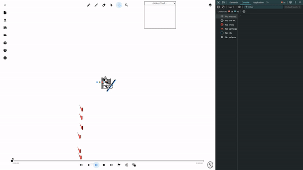
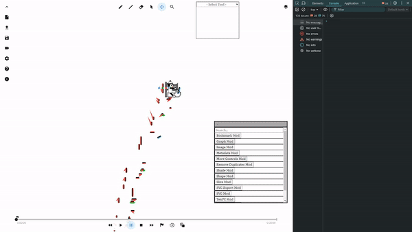

# The Line Rider Esolang

## What the heck is Line Rider?

From [the Wikipedia article](https://en.wikipedia.org/wiki/Line_Rider):

> Line Rider is a browser game or software toy ... originally created in September 2006 by Boštjan Čadež.

The idea behind Line Rider is simple - draw something on the canvas and a boy on a sled will ride on your drawing, falling off his sled if he hits it too hard. Line Rider's simplicity and approachability as a physics toy caused it to gain widespread appeal. Users would often spend hours create courses for this sledder to ride along, setting challenges to make longer and longer courses without causing the sledder to fall off. This led to the formation of a niche community of users dedicated to creating and sharing these courses (or "tracks," as they are referred to by community members) with each other.

Often, inner members of this community wanted to impress each other with cooler and cooler "tricks" that could keep the rider on the sled, gamifying the original concept. This posed questions about what sorts of tricks could be done without making the sledder fall off. How fast could the sledder go? What was the maximum speed that the sledder could hit a line and "survive"? Why would he sometimes fall through drawings? In searching for the answers to these questions, members of this community made a bunch of bizarre discoveries about how Line Rider's physics engine works.

## The "quirkiness" of Line Rider's physics engine

Line Rider's physics is unusual, to say the least.

There are two physics lines, red lines in blue lines. Blue lines are your standard collision lines that have no special effects. Red lines cause the sledder to accelerate in some direction based on an internal multiplier value.¹ There are also decorative green lines that play no role in the physics engine.

Things start to become strange when looking at properties of the underlying physics engine. Some of the more notable properties² include the following:

- The physics engine is deterministic and runs at 40 frames per second.
- The sledder is made of exactly 10 "contact points" that determine how the sledder interacts with physics lines.
- These points are connected by "bones" that have a level of tension allowed before they break and cause the sledder to fall off.
- Lines have one-sided, finite hitboxes that pull contact points to the surface of the line.
- Friction exists, but only certain contact points create it to varying degrees.
- Each frame can be broken into a momentum tick followed by sixth iterations, the last of which the rider can survive almost anything.

Because these properties are so unlike those of any other physics engine, the community decided to name tricks that utilize these strange behaviors "quirks." The overall genre of tracks made with these tricks has come to be known as "quirk." Since then, many different labels of tricks have been created in attempts to categorize tricks into one or more subgenre of quirk. One such subgenre will be used as the foundation of the Line Rider Esolang.

## Using "XY quirk" to define an instruction set

A subgenre of quirk dubbed "XY quirk" consists of tricks performed with strictly vertical and horizontal lines. We will utilize the restricted nature of lines in XY quirk to form a limited instruction set based on each line's rotation and type, with the goal of making these sorts of tracks perform computation.

The following image shows each permutation of line that can be used under the restrictions of XY quirk. Each of these permutations will be mapped to a corresponding instruction. Red lines will be given two instructions that depend on the sign of the red line's multiplier, for reasons given later.

![An image with four rotations listed at the top. The four rotations listed are 0 degrees, 90 degrees, 180 degrees, and 270 degrees. Below each rotation is a blue line with a gray box drawn along the line. For 0 degrees, the line is drawn horizontally and the gray box is below the line. For 90 degrees, the line is drawn vertically and the gray box is drawn to the left of the line. For 180 degrees, the line is drawn horizontally and the gray box is drawn above the line. For 270 degrees, the line is drawn vertically and the gray box is drawn to the right of the line. Below each blue line is a corresponding red line with a gray box drawn in the same orientation.](assets\line_rotation_visual.png "Line Rotations")

## Defining the instruction set

We define the instruction set from the 8 possible lines as follows.

<table markdown="1">
  <tr>
    <th>Rotation</th>
    <th>Blue Line Behavior</th>
    <th>Red Line Behavior, Positive M</th>
    <th>Red Line Behavior, Negative M</th>
  </tr>
  <tr>
    <td>0°</td>
    <td>Move to register 0</td>
    <td>Move to the <b>next</b> Mth register</td>
    <td>Move to the <b>previous</b> Mth register</td>
  </tr>
  <tr>
    <td>90°</td>
    <td>Reset current register to 0</td>
    <td><b>Increment</b> current register by M</td>
    <td><b>Decrement</b> current register by M</td>
  </tr>
  <tr>
    <td>180°</td>
    <td>Clear the input buffer</td>
    <td><b>Input</b> into the next M registers</td>
    <td><b>Output</b> the next M registers</td>
  </tr>
  <tr>
    <td>270°</td>
    <td>Stop the program</td>
    <td>If the value at the current address is not zero, relative jump M frames <b>forward</b>, else continue playing</td>
    <td>If the value at the current address is not zero, relative jump M frames <b>backward</b>, else continue playing</td>
  </tr>
</table>

The instructions corresponding to red lines depend on the internal multiplier, M, of the red line. The magnitude of the multiplier determines the strength of the instruction, and the sign of the multiplier determines the behavior.

Blue line instructions have completely different functionality from their red line counterparts. This choice was made based on the fact that blue lines are, in essence, red lines with 0 multiplier, a value that would have no effect on any of the red line defined instructions.

## Creating an interpreter

In practice, these instructions have no functionality without an interpreter running in the background to determine which line corresponds to which instruction. For the sake of ease, this interpreter has been written for the web version of Line Rider, which has extensive mod support available and offers all of the capabilities needed to achieve this sort of functionality.

This interpreter will keep track of the internal state of the program, which is a series of registers that can take values in the range of unsigned 8 bit integers. At the start, these registers are initialized with a value of zero. It also keeps track of an input buffer of unused characters.

The input buffer is used to prevent input overflow and clamp to the requested amount of input. The first instance that input gets requested, only the first M characters fill in the registers, and the rest get stored into the input buffer. On the next request, the interpreter checks to see if there are any characters remaining in the input buffer, uses those up, then asks for more input if it is needed. If there are not enough characters to fill M registers, then the remaining registers get set to 0.

The input accepts UTF8 characters and converts them to their corresponding character codes, and the output casts the values of the outputted registers back to UTF8 characters and outputs to the console.

The index on the timeline is used as a sort of program counter.³ The design of Line Rider maintains that tracks run as linear experiences without jumping around the timeline. The design of the interpreter bends this rule to allow for program jumps. If the program jumps out of bounds (say, to a negative index), the program halts.

In the case of multiple collisions on a particular frame, only the instruction with the earliest order of operation is chosen to run, and all other instructions are ignored. The order of operations is determined by line type and angle as follows (from earliest to latest): 0° blue, 90° blue, 180° blue, 270° blue, 0° red, 90° red, 180° red, 270° red.

For best results, the simulation should be ran at physics framerate without any smooth interpolation active. This ensures that physics frames match that playback framerate.

## Some example programs

With the definitions and logistics out of the way, we can now "write" some functional programs using these instructions. Below are some examples of track programs.

[This track](./assets/hello_program.track.json) prints "Hello {name}" where name is an input string.



Here's what the pseudocode looks like.
```
Add (12) * 6                  // H
Next register
Add (12) * 8 + 5              // e
Next register
Add (12) * 9                  // l
Next register
Add (12) * 9                  // l
Next register
Add 26 + 15 + 7 + 19 + 36 + 8 // o
Next register
Add 19 + 13                   // [Space]
Move to register 0
Next register x6
Take input into next 10 registers
Move to register 0
Output next 20 registers
Halt
```

[This track](./assets/fib_program.track.json) prints the first 6 fibonacci numbers. This demo only does the first 6 because printing more than 1 digit numbers requires extra calculations.



Here's what the pseudocode looks like.
```
Add 6
Next register
Add 1
Next register
Add 1
Previous register x2
Next register x2     <- Main
Add 48
Output next 1 register
Sub 48
Previous register
Next register        <- Loop1
Add 1
Next register
Add 1
Previous register x2
Sub 1
Jump to Loop1 if not 0
Next register
Previous register    <- Loop2
Add 1
Next register
Sub 1
Jump to Loop2 if not 0
Next register
Previous register    <- Loop3
Add 1
Next register
Sub 1
Jump to Loop3 if not 0
Previous register x3
Sub 1
Jump to Main if not 0
Halt
```

## Creating your own program

I've written a userscript that acts as the interpreter by detecting physics collisions and translating them into the appropriate instructions. Below are some steps to setup this userscript for testing your own Line Rider Esolang programs.

For debugging purposes, the global function `window.getProgState` is available to see the internal state of the program.

1) Install a browser extension that supports userscript execution, such as [Tampermonkey](https://www.tampermonkey.net/).
2) Install [the userscript](https://github.com/Malizma333/linerider-esolang/raw/main/line-rider-esolang-interpreter.user.js) to run the interpreter.
3) Make a track at [linerider.com](https://www.linerider.com/) and watch your program run from the developer console!

## Footnotes

¹ *This internal multiplier value takes the range of real numbers between -255 to 255 and is a relatively recent addition to modern versions of Line Rider.*

² *While not all of these tidbits are crucial to understanding the majority of the article, they are still an interesting example of complex behavior underlying seemingly simple processes.*

³ *Because of this, the implementation uses async methods to set the timeline to the proper index during jumps. This causes occasional errors when jumping too late and evaluating frames that shouldn't be evaluated. This can be mitigated by spacing out instructions.*